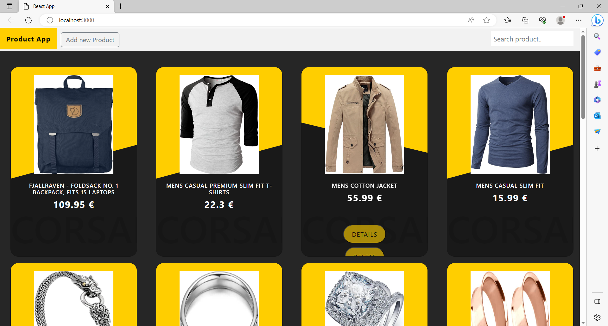

## Project Description
Welcome to the React E-Store, your go-to online shopping destination built with React.js. Discover a seamless shopping experience where you can explore, search, and interact with a diverse range of products. From fashion to electronics, the React E-Store offers a user-friendly interface that makes shopping a breeze.

Features
Product Search: Quickly find the products you're looking for using our intuitive search functionality. With real-time suggestions and predictive search, you'll spend less time searching and more time shopping.

Product Browsing: Explore an extensive catalog of products, each beautifully showcased with high-quality images and detailed descriptions. Whether you're a fashion aficionado or a tech enthusiast, you'll find products tailored to your preferences.

Product Details: Dive into the finer details of your favorite products. Learn about specifications, features, customer reviews, and more. Make informed decisions before adding items to your cart.

User-Friendly Cart: Seamlessly manage your shopping cart with our user-friendly interface. Add products, update quantities, and remove items with just a few clicks.

Effortless Checkout: Our streamlined checkout process ensures a hassle-free experience. Input your shipping details, choose a payment method, and confirm your order with ease.

Getting Started
Clone the Repository: Start by cloning this repository to your local machine using the git clone command.

Install Dependencies: Navigate to the project directory and run npm install to install the necessary dependencies.

Run the App: Launch the app with npm start. Open your web browser and navigate to http://localhost:3000 to see the React E-Store in action.

Explore and Shop: Browse through the products, search for items, and enjoy a smooth shopping experience.

Screenshots

My portfolio :

Demo video :

